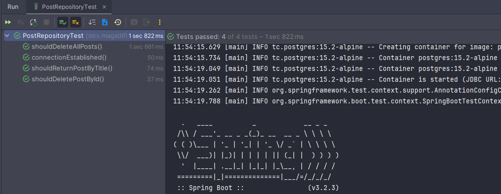
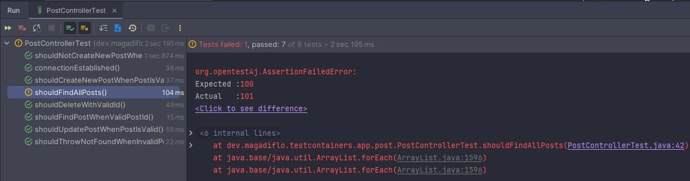

# [Spring Boot Testcontainers - Integration Testing made easy!](https://www.youtube.com/watch?v=erp-7MCK5BU)

Tutorial tomado del canal de **youtube de Dan Vega**.

En este tutorial, aprenderá cómo escribir una prueba de integración en Spring Boot usando Testcontainers. Usaremos
Testcontainers para poner en marcha una base de datos PostgreSQL en un contenedor y usarla para nuestras pruebas.
Escribiremos una prueba de repositorio y una prueba de controlador que llame al repositorio que se comunica con nuestra
base de datos.

---

## Dependencias iniciales

````xml
<!--Spring Boot 3.2.3-->
<!--Java 21-->
<dependencies>
    <dependency>
        <groupId>org.springframework.boot</groupId>
        <artifactId>spring-boot-starter-data-jdbc</artifactId>
    </dependency>
    <dependency>
        <groupId>org.springframework.boot</groupId>
        <artifactId>spring-boot-starter-web</artifactId>
    </dependency>
    <dependency>
        <groupId>org.springframework.boot</groupId>
        <artifactId>spring-boot-starter-validation</artifactId>
    </dependency>

    <dependency>
        <groupId>org.springframework.boot</groupId>
        <artifactId>spring-boot-docker-compose</artifactId>
        <scope>runtime</scope>
        <optional>true</optional>
    </dependency>
    <dependency>
        <groupId>org.postgresql</groupId>
        <artifactId>postgresql</artifactId>
        <scope>runtime</scope>
    </dependency>
    <dependency>
        <groupId>org.springframework.boot</groupId>
        <artifactId>spring-boot-starter-test</artifactId>
        <scope>test</scope>
    </dependency>
</dependencies>
````

### [Docker Compose Support in Spring Boot 3.1](https://spring.io/blog/2023/06/21/docker-compose-support-in-spring-boot-3-1)

En este tutorial trabajaremos con una nueva dependencia que nunca antes había usado. La dependencia
`Docker Compose Support`, proporciona compatibilidad con `Docker Compose` para mejorar la experiencia de desarrollo.

La etiqueta `optional` se establece en `true` si queremos usar otras funciones del proyecto pero excluir
la compatibilidad con `Docker Compose`:

````xml
<!--Dependencia por defecto creada desde Spring Initializr-->
<dependency>
    <groupId>org.springframework.boot</groupId>
    <artifactId>spring-boot-docker-compose</artifactId>
    <scope>runtime</scope>
    <optional>true</optional>
</dependency>
````

El proyecto se generó desde `Spring Initializr`, allí agregamos la dependencia de `Docker Compose Support`, al hacer
esto, en automático nos crea el archivo `compose.yml` para trabajar con `docker compose`.

Por defecto, al crear el proyecto con la dependencia antes mencionada, se crea el archivo `compose.yml` con el
siguiente contenido:

````yml
services:
  postgres:
    image: 'postgres:latest'
    environment:
      - 'POSTGRES_DB=mydatabase'
      - 'POSTGRES_PASSWORD=secret'
      - 'POSTGRES_USER=myuser'
    ports:
      - '5432'  
````

Normalmente, ejecutamos `docker compose up` para iniciar y `docker compose down` para detener nuestros contenedores
basados en `compose.yml`. Ahora podemos delegar esos comandos de `Docker Compose a Spring Boot 3`. Mientras la
aplicación Spring Boot se inicia o se detiene, también administrará nuestros contenedores.

Además, tiene administración incorporada para múltiples servicios, como bases de datos `SQL, MongoDB, Cassandra, etc.`
Por lo tanto, es posible que no necesitemos clases de configuración o propiedades para duplicar en el archivo de
recursos de nuestra aplicación.

Finalmente, veremos que podemos usar este soporte con imágenes personalizadas de Docker y perfiles de Docker Compose.

`Spring Boot 3.1` detectará que hay un archivo Docker Compose presente y ejecutará `docker compose up` por usted antes
de conectarse a los servicios. Si los servicios ya se están ejecutando, también lo detectará y los utilizará. También
ejecutará `docker compose stop` cuando la aplicación se cierre. Atrás quedaron los días en los que los contenedores
Docker persistentes consumían su preciosa memoria.

Las imágenes iniciadas por Docker Compose se detectan y utilizan automáticamente para crear beans ConnectionDetails que
apunten a los servicios. **Eso significa que no tiene que poner propiedades en su configuración, no tiene que recordar
cómo construir URL JDBC de PostgreSQL, etc.**

Con `Spring Boot 3.1`, todo lo que necesita hacer es proporcionar el archivo `compose.yaml` y dejar que Spring Boot se
encargue del resto. **¡Simplemente funciona!**

## Clases e interfaces iniciales

Creamos la entidad que estará mapeado a la tabla `posts` de la base de datos. En esta oportunidad usaremos un `record`:

````java

@Table(name = "posts")
public record Post(
        @Id
        Integer id,
        Integer userId,
        @NotBlank
        String title,
        @NotBlank
        String body,
        @Version
        Integer version) {
}
````

Creamos un repositorio que herede de la interfaz `ListCrudRepository`, quien es una interfaz para operaciones `CRUD`
genéricas en un repositorio para un tipo específico. Esta es una extensión de `CrudRepository` que devuelve `List` en
lugar de Iterable cuando corresponda.

````java
public interface PostRepository extends ListCrudRepository<Post, Integer> {
}
````

Creamos un record que contendrá una lista de `Post`. Usaremos el `Posts` para poder poblar la tabla en la base de datos:

````java
public record Posts(List<Post> posts) {
}
````

Finalmente, creamos una clase de componente que nos permitirá poblar la tabla `posts` en la base de datos. Los datos
estarán en un archivo `json` llamado `posts.json` ubicados en el directorio `resources/data`. Obtendremos los datos del
archivo `json` y lo convertiremos a un objeto del tipo `Posts`, quien finalmente será usado para persistir en la BD
usando el `postRepository`:

````java

@Component
public class PostDataLoader implements CommandLineRunner {
    private static final Logger LOG = LoggerFactory.getLogger(PostDataLoader.class);
    private final ObjectMapper objectMapper;
    private final PostRepository postRepository;

    public PostDataLoader(ObjectMapper objectMapper, PostRepository postRepository) {
        this.objectMapper = objectMapper;
        this.postRepository = postRepository;
    }

    @Override
    public void run(String... args) throws Exception {
        if (this.postRepository.count() == 0) {
            String POSTS_JSON = "/data/posts.json";
            LOG.info("Cargando posts dentro de la base de datos desde JSON: {}", POSTS_JSON);

            try (InputStream inputStream = TypeReference.class.getResourceAsStream(POSTS_JSON)) {

                Posts posts = this.objectMapper.readValue(inputStream, Posts.class);
                this.postRepository.saveAll(posts.posts());

            } catch (IOException e) {
                throw new RuntimeException("Falló al leer datos del JSON", e);
            }
        }
    }
}
````

**DONDE**

- `InputStream`, esta clase abstracta es la superclase de todas las clases que representan un flujo de entrada de bytes.
  La clase abstracta `InputStream` declara los métodos para leer datos desde una fuente concreta y es la clase base de
  la mayor parte de los flujos de entrada en `java.io`, permite leer ficheros byte a byte.
- `TypeReference.class.getResourceAsStream()`, como parámetro recibe el nombre del `recurso deseado` y como valor de
  retorno devuelve un objeto `InputStream`; `null` si no se encuentra ningún recurso con ese nombre, el recurso está en
  un paquete que no está abierto al menos al módulo llamante, o el administrador de seguridad deniega el acceso al
  recurso.

## Configuraciones

Creamos el siguiente directorio y archivo `/resources/data/posts.json`. Dentro de él, colocaremos el siguiente
contenido:

````bash
{
  "posts": [
    {
      "userId": 1,
      "id": 1,
      "title": "sunt aut facere repellat provident occaecati excepturi optio reprehenderit",
      "body": "quia et suscipit\nsuscipit recusandae consequuntur expedita et cum\nreprehenderit molestiae ut ut quas totam\nnostrum rerum est autem sunt rem eveniet architecto"
    },
    {
      "userId": 1,
      "id": 2,
      "title": "qui est esse",
      "body": "est rerum tempore vitae\nsequi sint nihil reprehenderit dolor beatae ea dolores neque\nfugiat blanditiis voluptate porro vel nihil molestiae ut reiciendis\nqui aperiam non debitis possimus qui neque nisi nulla"
    },
    {...}
  ]
}
````

En el `application.yml` agregamos las siguientes configuraciones:

````yml
spring:
  application:
    name: spring-boot-testcontainers-jdbc

  sql:
    init:
      mode: always
````

Recordar que la segunda configuración `spring.sql.init.mode=always` permite que el archivo `schema.sql` pueda
ejecutarse.

Ahora, el archivo `schema.sql` contendrá el `DDL` de nuestra tabla `posts`:

````sql
CREATE TABLE IF NOT EXISTS posts(
    id INT NOT NULL PRIMARY KEY,
    user_id INT NOT NULL,
    title VARCHAR(250) NOT NULL,
    body TEXT NOT NULL,
    version INT
);
````

Finalmente, nuestro archivo `compose.yml` quedará configurado de la siguiente manera:

````yaml
services:
  postgres:
    container_name: postgres
    image: postgres:15.2-alpine
    environment:
      POSTGRES_DB: db_testcontainers_jdbc
      POSTGRES_PASSWORD: magadiflo
      POSTGRES_USER: magadiflo
    ports:
      - 5433:5432
````

## Ejecutando aplicación

Como estamos usando la dependencia de `Docker Compose Support` es importante que `Docker` esté ejecutándose previamente,
ya que la dependencia hará uso de `docker compose` para poder levantar el contenedor que tenemos definido en el archivo
`compose.yaml`, además, al levantar el proyecto no solo se creará el contenedor de la base de datos en automático, sino
también se poblará con los datos definidos en el archivo `data/posts.json`.

Antes de ejecutar la aplicación vemos que no hay ningún contenedor ejecutándose:

````bash
$ docker container ls -a
CONTAINER ID   IMAGE     COMMAND   CREATED   STATUS    PORTS     NAMES
````

Después de ejecutar la aplicación:

````bash
$ docker container ls -a
CONTAINER ID   IMAGE                  COMMAND                  CREATED          STATUS          PORTS                    NAMES
2046394862cf   postgres:15.2-alpine   "docker-entrypoint.s…"   13 seconds ago   Up 12 seconds   0.0.0.0:5433->5432/tcp   postgres
````

Si vemos el log generado en el IDE:

````bash
INFO 11500 --- [spring-boot-testcontainers-jdbc] [           main] d.m.testcontainers.app.MainApplication   : Starting MainApplication using Java 21.0.1 with PID 11500 (M:\PROGRAMACION\DESARROLLO_JAVA_SPRING\02.youtube\15.dan_vega\spring-boot-testcontainers-jdbc\target\classes started by USUARIO in M:\PROGRAMACION\DESARROLLO_JAVA_SPRING\02.youtube\15.dan_vega\spring-boot-testcontainers-jdbc)
INFO 11500 --- [spring-boot-testcontainers-jdbc] [           main] d.m.testcontainers.app.MainApplication   : No active profile set, falling back to 1 default profile: "default"
INFO 11500 --- [spring-boot-testcontainers-jdbc] [           main] .s.b.d.c.l.DockerComposeLifecycleManager : Using Docker Compose file 'M:\PROGRAMACION\DESARROLLO_JAVA_SPRING\02.youtube\15.dan_vega\spring-boot-testcontainers-jdbc\compose.yaml'
INFO 11500 --- [spring-boot-testcontainers-jdbc] [utReader-stderr] o.s.boot.docker.compose.core.DockerCli   :  Network spring-boot-testcontainers-jdbc_default  Creating
INFO 11500 --- [spring-boot-testcontainers-jdbc] [utReader-stderr] o.s.boot.docker.compose.core.DockerCli   :  Network spring-boot-testcontainers-jdbc_default  Created
INFO 11500 --- [spring-boot-testcontainers-jdbc] [utReader-stderr] o.s.boot.docker.compose.core.DockerCli   :  Container postgres  Creating
INFO 11500 --- [spring-boot-testcontainers-jdbc] [utReader-stderr] o.s.boot.docker.compose.core.DockerCli   :  Container postgres  Created
INFO 11500 --- [spring-boot-testcontainers-jdbc] [utReader-stderr] o.s.boot.docker.compose.core.DockerCli   :  Container postgres  Starting
INFO 11500 --- [spring-boot-testcontainers-jdbc] [utReader-stderr] o.s.boot.docker.compose.core.DockerCli   :  Container postgres  Started
INFO 11500 --- [spring-boot-testcontainers-jdbc] [utReader-stderr] o.s.boot.docker.compose.core.DockerCli   :  Container postgres  Waiting
INFO 11500 --- [spring-boot-testcontainers-jdbc] [utReader-stderr] o.s.boot.docker.compose.core.DockerCli   :  Container postgres  Healthy
INFO 11500 --- [spring-boot-testcontainers-jdbc] [           main] .s.d.r.c.RepositoryConfigurationDelegate : Bootstrapping Spring Data JDBC repositories in DEFAULT mode.
INFO 11500 --- [spring-boot-testcontainers-jdbc] [           main] .s.d.r.c.RepositoryConfigurationDelegate : Finished Spring Data repository scanning in 118 ms. Found 1 JDBC repository interface.
INFO 11500 --- [spring-boot-testcontainers-jdbc] [           main] o.s.b.w.embedded.tomcat.TomcatWebServer  : Tomcat initialized with port 8080 (http)
INFO 11500 --- [spring-boot-testcontainers-jdbc] [           main] o.apache.catalina.core.StandardService   : Starting service [Tomcat]
INFO 11500 --- [spring-boot-testcontainers-jdbc] [           main] o.apache.catalina.core.StandardEngine    : Starting Servlet engine: [Apache Tomcat/10.1.19]
INFO 11500 --- [spring-boot-testcontainers-jdbc] [           main] o.a.c.c.C.[Tomcat].[localhost].[/]       : Initializing Spring embedded WebApplicationContext
INFO 11500 --- [spring-boot-testcontainers-jdbc] [           main] w.s.c.ServletWebServerApplicationContext : Root WebApplicationContext: initialization completed in 2728 ms
INFO 11500 --- [spring-boot-testcontainers-jdbc] [           main] com.zaxxer.hikari.HikariDataSource       : HikariPool-1 - Starting...
INFO 11500 --- [spring-boot-testcontainers-jdbc] [           main] com.zaxxer.hikari.pool.HikariPool        : HikariPool-1 - Added connection org.postgresql.jdbc.PgConnection@9cfc77
INFO 11500 --- [spring-boot-testcontainers-jdbc] [           main] com.zaxxer.hikari.HikariDataSource       : HikariPool-1 - Start completed.
INFO 11500 --- [spring-boot-testcontainers-jdbc] [           main] o.s.b.w.embedded.tomcat.TomcatWebServer  : Tomcat started on port 8080 (http) with context path ''
INFO 11500 --- [spring-boot-testcontainers-jdbc] [           main] d.m.testcontainers.app.MainApplication   : Started MainApplication in 29.787 seconds (process running for 30.772)
INFO 11500 --- [spring-boot-testcontainers-jdbc] [           main] d.m.t.app.post.PostDataLoader            : Cargando posts dentro de la base de datos desde JSON: /data/posts.json
````

Aunque vemos en el `log` el mensaje de que los datos se han cargado correctamente en la base de datos, vamos a
comprobarlo por nuestra cuenta si eso es cierto:

````bash
$ docker container exec -it postgres /bin/sh
/ # psql -U magadiflo -d db_testcontainers_jdbc
psql (15.2)
Type "help" for help.

db_testcontainers_jdbc=# \d
         List of relations
 Schema | Name  | Type  |   Owner
--------+-------+-------+-----------
 public | posts | table | magadiflo
(1 row)

db_testcontainers_jdbc=# SELECT * FROM posts WHERE id = 1;
 id | user_id |                                   title                                    |                        body                         | version
----+---------+----------------------------------------------------------------------------+-----------------------------------------------------+---------
  1 |       1 | sunt aut facere repellat provident occaecati excepturi optio reprehenderit | quia et suscipit                                   +|       0
    |         |                                                                            | suscipit recusandae consequuntur expedita et cum   +|
    |         |                                                                            | reprehenderit molestiae ut ut quas totam           +|
    |         |                                                                            | nostrum rerum est autem sunt rem eveniet architecto |
(1 row)
````

Si detenemos la aplicación, el contenedor en Docker quedará en `exited`:

````bash
$ docker container ls -a
CONTAINER ID   IMAGE                  COMMAND                  CREATED         STATUS                     PORTS     NAMES
2046394862cf   postgres:15.2-alpine   "docker-entrypoint.s…"   5 minutes ago   Exited (0) 4 seconds ago             postgres
````

## Creando PostController

Antes de crear el `PostController` crearemos una clase personalizada de excepción `PostNotFoundException`:

````java

@ResponseStatus(HttpStatus.NOT_FOUND)
public class PostNotFoundException extends RuntimeException {

}
````

La clase anterior, la usaremos para lanzar cuando no se encuentre el recurso solicitado.

Ahora, creamos los endpoints:

````java

@RestController
@RequestMapping(path = "/api/v1/posts")
public class PostController {

    private static final Logger LOG = LoggerFactory.getLogger(PostDataLoader.class);
    private final PostRepository postRepository;

    public PostController(PostRepository postRepository) {
        this.postRepository = postRepository;
    }

    @GetMapping
    public ResponseEntity<List<Post>> findAllPosts() {
        return ResponseEntity.ok(this.postRepository.findAll());
    }

    @GetMapping(path = "/{id}")
    public ResponseEntity<Post> findById(@PathVariable Integer id) {
        return ResponseEntity.ok(this.postRepository.findById(id).orElseThrow(PostNotFoundException::new));
    }

    @PostMapping
    public ResponseEntity<Post> savePost(@Valid @RequestBody Post post) {
        Post postDB = this.postRepository.save(post);
        URI uri = URI.create("/api/v1/posts/" + postDB.id());
        return ResponseEntity.created(uri).body(postDB);
    }

    @PutMapping(path = "/{id}")
    public ResponseEntity<Post> updatePost(@PathVariable Integer id, @RequestBody Post post) {
        return this.postRepository.findById(id)
                .map(postDB -> {

                    Post updatedPost = new Post(postDB.id(),
                            post.userId(),
                            post.title(),
                            post.body(),
                            post.version());
                    return ResponseEntity.ok(this.postRepository.save(updatedPost));
                })
                .orElseThrow(PostNotFoundException::new);
    }

    @DeleteMapping(path = "/{id}")
    public ResponseEntity<Void> deletePost(@PathVariable Integer id) {
        return this.postRepository.findById(id)
                .map(postDB -> {
                    this.postRepository.deleteById(postDB.id());
                    return new ResponseEntity<Void>(HttpStatus.NO_CONTENT);
                })
                .orElseThrow(PostNotFoundException::new);
    }

}
````

## Levantando aplicación y probando endpoints

Recordemos que como tenemos la dependencia de `Docker Compose Support`, la conexión a la base de datos, lo hará
automáticamente nuestra aplicación de `Spring Boot`, es decir, no es necesario agregar en el `application.yml`
las configuraciones que siempre hacemos.

Una vez levantado la aplicación, realizamos algunas peticiones para probar el funcionamiento correcto de los endpoints:

````bash
$ curl -v http://localhost:8080/api/v1/posts | jq

>
< HTTP/1.1 200
<
[
  {
    "id": 1,
    "userId": 1,
    "title": "sunt aut facere repellat provident occaecati excepturi optio reprehenderit",
    "body": "quia et suscipit\nsuscipit recusandae consequuntur expedita et cum\nreprehenderit molestiae ut ut quas totam\nnostrum rerum est autem sunt rem eveniet architecto",
    "version": 0
  },
  {
    "id": 2,
    "userId": 1,
    "title": "qui est esse",
    "body": "est rerum tempore vitae\nsequi sint nihil reprehenderit dolor beatae ea dolores neque\nfugiat blanditiis voluptate porro vel nihil molestiae ut reiciendis\nqui aperiam non debitis possimus qui neque nisi nulla",
    "version": 0
  },
  {...}
]
````

````bash
$ curl -v http://localhost:8080/api/v1/posts/1 | jq

>
< HTTP/1.1 200
<
{
  "id": 1,
  "userId": 1,
  "title": "sunt aut facere repellat provident occaecati excepturi optio reprehenderit",
  "body": "quia et suscipit\nsuscipit recusandae consequuntur expedita et cum\nreprehenderit molestiae ut ut quas totam\nnostrum rerum est autem sunt rem eveniet architecto",
  "version": 0
}
````

````bash
$ curl -v -X DELETE http://localhost:8080/api/v1/posts/1 | jq

>
< HTTP/1.1 204
<
````

````bash
$ curl -v -X DELETE http://localhost:8080/api/v1/posts/1 | jq

>
< HTTP/1.1 404
<
{
  "timestamp": "2024-03-12T00:28:52.535+00:00",
  "status": 404,
  "error": "Not Found",
  "path": "/api/v1/posts/1"
}
````

---

# Trabajando con Testcontainers

---

## Dependencias adicionales

Utilizamos la web de `Spring Initializr` para obtener la dependencia de `testcontainers`. Teniendo las dependencias
iniciales, agregamos la dependencia `Testcontainers`, al hacerlo, automáticamente se agregarán dos dependencias
adicionales: `junit-jupiter` y `postgresql`, ambos pertenecientes al **groupId** `org.testcontainers`.

Ojo, es importante que las dependencias iniciales estén en la web al momento de agregar la dependencia `Testcontainers`,
o en su defecto que esté presente la dependencia del driver de `PostgreSQL`, eso porque al agregar el `Testcontainers`
en automático detectará el driver de postgres para generar su dependencia de testcontainer.

````xml

<dependencies>
    <dependency>
        <groupId>org.springframework.boot</groupId>
        <artifactId>spring-boot-testcontainers</artifactId>
        <scope>test</scope>
    </dependency>
    <dependency>
        <groupId>org.testcontainers</groupId>
        <artifactId>junit-jupiter</artifactId>
        <scope>test</scope>
    </dependency>
    <dependency>
        <groupId>org.testcontainers</groupId>
        <artifactId>postgresql</artifactId>
        <scope>test</scope>
    </dependency>
</dependencies>
````

## Método personalizado en PostRepository

Para ejemplificar este tutorial, crearemos un método personalizado en el `PostRepository`:

````java
public interface PostRepository extends ListCrudRepository<Post, Integer> {
    Post findByTitle(String title);
}
````

Por lo general, cuando se realizan pruebas, es recomendable hacer dichas pruebas sobre métodos personalizados que
hayamos creado, dado que los métodos que vienen ya construidos en Spring Data, están probados y sabemos que sí
funcionan.

## Pruebas al repository

En este apartado escribiremos las pruebas para el repositorio `PostRepository`, para ello nos situamos dentro de
dicha interfaz y presionamos `Ctrl + Shift + T` y damos en `Create New Test...`.

````java

@Testcontainers
@DataJdbcTest
@AutoConfigureTestDatabase(replace = AutoConfigureTestDatabase.Replace.NONE)
class PostRepositoryTest {

    @Container
    @ServiceConnection
    private static final PostgreSQLContainer<?> POSTGRES_CONTAINER = new PostgreSQLContainer<>("postgres:15.2-alpine");

    @Autowired
    private PostRepository postRepository;

    @BeforeEach
    void setUp() {
        List<Post> posts = List.of(
                new Post(1, 1, "Hello World!", "This is my first post", null),
                new Post(2, 1, "Hi", "How are you?", null)
        );
        this.postRepository.saveAll(posts);
    }

    @Test
    void connectionEstablished() {
        Assertions.assertTrue(POSTGRES_CONTAINER.isCreated());
        Assertions.assertTrue(POSTGRES_CONTAINER.isRunning());
    }

    @Test
    void shouldReturnPostByTitle() {
        Post post = this.postRepository.findByTitle("Hello World!");
        Assertions.assertNotNull(post);
    }

    @Test
    void shouldDeletePostById() {
        int postId = 1;

        Optional<Post> postOptional = this.postRepository.findById(postId);
        Assertions.assertTrue(postOptional.isPresent());

        this.postRepository.deleteById(postId);

        postOptional = this.postRepository.findById(postId);
        Assertions.assertTrue(postOptional.isEmpty());
    }

    @Test
    void shouldDeleteAllPosts() {
        this.postRepository.deleteAll();
        Assertions.assertEquals(0, this.postRepository.count());
    }
}
````

**DONDE**

- `@Testcontainers` es una extensión de `JUnit Jupiter` para activar el inicio y la parada automáticos de los
  contenedores utilizados en un caso de prueba. La extensión `@Testcontainers` encuentra todos los campos anotados
  con `@Container` y llama a sus métodos de ciclo de vida de contenedor. **Los contenedores declarados como campos
  estáticos se compartirán entre los métodos de prueba. Se iniciarán solo una vez antes de ejecutar cualquier método
  de prueba y se detendrán después de que se haya ejecutado el último método de prueba.** Los contenedores declarados
  como campos de instancia se iniciarán y detendrán para cada método de prueba.


- `@DataJdbcTest`, anotación que se puede utilizar para una prueba de Data JDBC que se centra únicamente en los
  componentes de `Data JDBC`.
  El uso de esta anotación deshabilitará la configuración automática completa, buscará subclases
  de `AbstractJdbcConfiguration` y aplicará solo la configuración relevante a las pruebas de Data JDBC.
  **De forma predeterminada, las pruebas anotadas con `@DataJdbcTest` son transaccionales y se revierten al final de
  cada prueba.** También utilizan una base de datos integrada en memoria (que reemplaza cualquier fuente de datos
  explícita o generalmente configurada automáticamente). **La anotación `@AutoConfigureTestDatabase` se puede utilizar
  para anular estas configuraciones.**
  Si desea cargar la configuración completa de su aplicación, pero utiliza una base de datos integrada, debe
  considerar `@SpringBootTest` combinado con `@AutoConfigureTestDatabase` en lugar de esta anotación.


- `@AutoConfigureTestDatabase(replace = AutoConfigureTestDatabase.Replace.NONE)`: Como usamos la base de
  datos `POSTGRES de TestContainers`, tenemos que decirle al framework de test de Spring que no debería intentar
  reemplazar nuestra base de datos.

    - `@AutoConfigureTestDatabase`, anotación que se puede aplicar a una clase de prueba para **configurar una base de
      datos de prueba** para usar en lugar del DataSource definido por la aplicación o configurado automáticamente. En
      el caso de varios beans DataSource, solo se considera @Primary DataSource.
    - `AutoConfigureTestDatabase.Replace.NONE`, no reemplace la fuente de datos predeterminada de la aplicación.


- La anotación `@Container` se usa junto con la anotación `@Testcontainers` para marcar los contenedores que deben ser
  administrados por la extensión `@Testcontainers`.


- `PostgreSQLContainer`, Implementación de Testcontainers para PostgreSQL. Imagen compatible: postgres Puertos
  expuestos: 5432


- `@ServiceConnection`, anotación utilizada para indicar que un campo o método es un `ContainerConnectionSource` que
  proporciona un servicio al que se puede conectar.

Con el siguiente método de test podemos comprobar que nuestro contendor de postgres se ha creado y está ejecutándose:

````java

@Test
void connectionEstablished() {
    Assertions.assertTrue(POSTGRES_CONTAINER.isCreated());
    Assertions.assertTrue(POSTGRES_CONTAINER.isRunning());
}
````

Al ejecutar todos los test de `PostRepositoryTest` vemos el siguiente resultado:



## Pruebas al controlador

En este apartado escribiremos las pruebas para el controlador `PostController`, para ello nos situamos dentro de
dicha clase y presionamos `Ctrl + Shift + T` y damos en `Create New Test...`.

**NOTA**

> Si estamos pensando en usar el nuevo `RestClient`, por ahora no se puede usar en entornos de pruebas, así que
> usaremos o el tradicional `TestRestTemplate` o el `WebClientTest`.

````java
/**
 * Prueba de integración
 */
@Testcontainers
@SpringBootTest(webEnvironment = SpringBootTest.WebEnvironment.RANDOM_PORT)
class PostControllerTest {

    @Container
    @ServiceConnection
    private static final PostgreSQLContainer<?> POSTGRES_CONTAINER = new PostgreSQLContainer<>("postgres:15.2-alpine");

    @Autowired
    private TestRestTemplate restTemplate;

    @Test
    void connectionEstablished() {
        Assertions.assertTrue(POSTGRES_CONTAINER.isCreated());
        Assertions.assertTrue(POSTGRES_CONTAINER.isRunning());
    }

    @Test
    void shouldFindAllPosts() {
        Post[] posts = this.restTemplate.getForObject("/api/v1/posts", Post[].class);
        Assertions.assertEquals(100, posts.length);
    }

    @Test
    void shouldFindPostWhenValidPostId() {
        ResponseEntity<Post> response = this.restTemplate.exchange("/api/v1/posts/{id}", HttpMethod.GET, null, Post.class, Collections.singletonMap("id", 1));
        Assertions.assertEquals(HttpStatus.OK, response.getStatusCode());
        Assertions.assertNotNull(response.getBody());
    }

    @Test
    void shouldThrowNotFoundWhenInvalidPostId() {
        ResponseEntity<Post> response = this.restTemplate.exchange("/api/v1/posts/{id}", HttpMethod.GET, null, Post.class, Collections.singletonMap("id", 500));
        Assertions.assertEquals(HttpStatus.NOT_FOUND, response.getStatusCode());
    }

    @Test
    void shouldCreateNewPostWhenPostIsValid() {
        Post post = new Post(101, 1, "Post 101", "Body 101", null);

        ResponseEntity<Post> response = this.restTemplate.exchange("/api/v1/posts", HttpMethod.POST, new HttpEntity<>(post), Post.class);

        Assertions.assertEquals(HttpStatus.CREATED, response.getStatusCode());
        Assertions.assertNotNull(response.getBody());
        Assertions.assertEquals(101, response.getBody().id());
        Assertions.assertEquals(1, response.getBody().userId());
        Assertions.assertEquals("Post 101", response.getBody().title());
        Assertions.assertEquals("Body 101", response.getBody().body());
    }

    @Test
    void shouldNotCreateNewPostWhenValidationFails() {
        Post post = new Post(101, 1, " ", null, null);

        ResponseEntity<Post> response = this.restTemplate.exchange("/api/v1/posts", HttpMethod.POST, new HttpEntity<>(post), Post.class);

        Assertions.assertEquals(HttpStatus.BAD_REQUEST, response.getStatusCode());
    }

    @Test
    void shouldUpdatePostWhenPostIsValid() {
        ResponseEntity<Post> responseGet = this.restTemplate.exchange("/api/v1/posts/{id}", HttpMethod.GET, null, Post.class, Collections.singletonMap("id", 99));
        Assertions.assertEquals(HttpStatus.OK, responseGet.getStatusCode());
        Assertions.assertNotNull(responseGet.getBody());

        Post postToUpdate = new Post(null, responseGet.getBody().userId(), "New post title #1", "New post body #1", responseGet.getBody().version());
        ResponseEntity<Post> responsePut = this.restTemplate.exchange("/api/v1/posts/{id}", HttpMethod.PUT, new HttpEntity<>(postToUpdate), Post.class, Collections.singletonMap("id", 99));

        Assertions.assertEquals(HttpStatus.OK, responsePut.getStatusCode());
        Assertions.assertNotNull(responsePut.getBody());

        Assertions.assertEquals(99, responsePut.getBody().id());
        Assertions.assertEquals(postToUpdate.title(), responsePut.getBody().title());
        Assertions.assertEquals(postToUpdate.body(), responsePut.getBody().body());
        Assertions.assertEquals(postToUpdate.version() + 1, responsePut.getBody().version());
    }

    @Test
    void shouldDeleteWithValidId() {
        ResponseEntity<Void> response = this.restTemplate.exchange("/api/v1/posts/{id}", HttpMethod.DELETE, null, Void.class, Collections.singletonMap("id", 80));
        Assertions.assertEquals(HttpStatus.NO_CONTENT, response.getStatusCode());
    }
}
````

**DONDE**

- `@Testcontainers` es una extensión de `JUnit Jupiter` para activar el inicio y la parada automáticos de los
  contenedores utilizados en un caso de prueba. La extensión `@Testcontainers` encuentra todos los campos anotados
  con `@Container` y llama a sus métodos de ciclo de vida de contenedor. **Los contenedores declarados como campos
  estáticos se compartirán entre los métodos de prueba. Se iniciarán solo una vez antes de ejecutar cualquier método
  de prueba y se detendrán después de que se haya ejecutado el último método de prueba.** Los contenedores declarados
  como campos de instancia se iniciarán y detendrán para cada método de prueba.


- `SpringBootTest`, anotación que se puede especificar en una clase de prueba que ejecuta pruebas basadas en Spring
  Boot. Proporciona las siguientes características además del marco Spring TestContext normal:
    - Utiliza SpringBootContextLoader como ContextLoader predeterminado cuando no se define ningún
      @ContextConfiguration(loader=...) específico.
    - Busca automáticamente @SpringBootConfiguration cuando no se utiliza @Configuration anidada y no se especifican
      clases explícitas.
    - Permite definir propiedades de entorno personalizadas utilizando el atributo de propiedades.
    - Permite definir argumentos de la aplicación utilizando el atributo args.
    - Proporciona soporte para diferentes modos de entorno web, incluida la capacidad de iniciar un servidor web en
      pleno funcionamiento escuchando en un puerto definido o aleatorio.
    - Registra un bean `TestRestTemplate` y/o `WebTestClient` para su uso en pruebas web que utilizan un servidor web en
      pleno funcionamiento.


- `SpringBootTest.WebEnvironment.RANDOM_PORT`, Crea un contexto de aplicación web (reactivo o basado en servlet) y
  establece una propiedad de entorno server.port=0 (que normalmente activa la escucha en un puerto aleatorio). A menudo
  se utiliza junto con un campo inyectado `@LocalServerPort` en la prueba.


- La anotación `@Container` se usa junto con la anotación `@Testcontainers` para marcar los contenedores que deben ser
  administrados por la extensión `@Testcontainers`.


- `PostgreSQLContainer`, Implementación de Testcontainers para PostgreSQL. Imagen compatible: postgres Puertos
  expuestos: 5432


- `@ServiceConnection`, anotación utilizada para indicar que un campo o método es un `ContainerConnectionSource` que
  proporciona un servicio al que se puede conectar.

Al ejecutar todos los métodos de prueba obtenemos el siguiente resultado:



Como nuestro `POSTGRES_CONTAINER` es compartido entre todos los métodos test, la ejecución del
test `shouldFindAllPosts` está siendo afectado por la ejecución del método `shouldCreateNewPostWhenPostIsValid`, ya que
al crear un nuevo post el total de elementos ya no serían 100 sino 101, por esa razón es que falla. Ahora, **intenté
utilizar la anotación `@Transactional` y `@Rollback` pero no funcionó (lo mismo ocurrió en el video tutorial).** 
